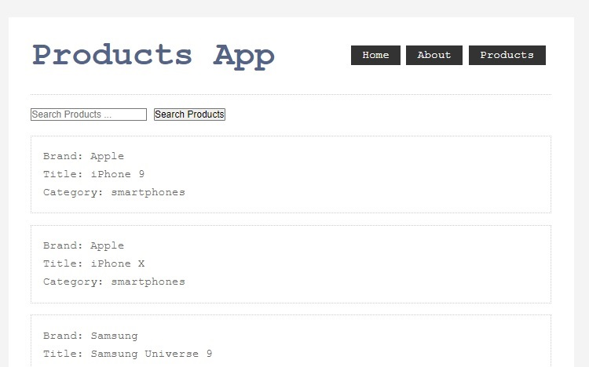
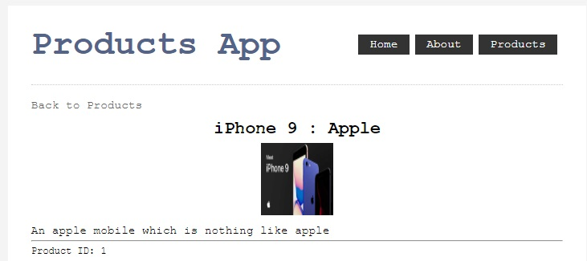
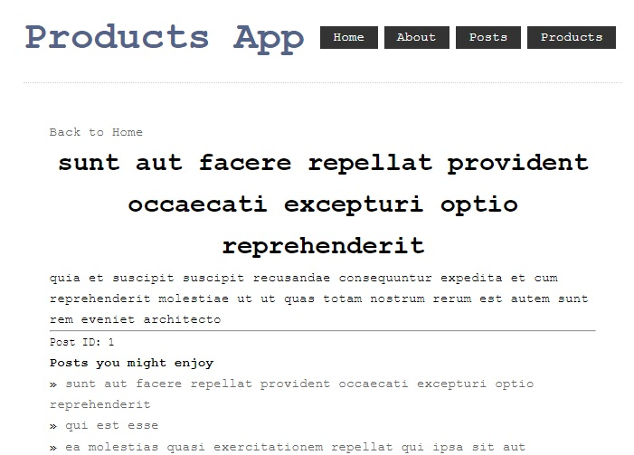

# NuxtJS 2 Beginner

* API's used: https://dummyjson.com/docs/products
* References
  * Nuxt2 Get Started: https://nuxtjs.org/docs/get-started/installation
  * Nuxt2 Examples: https://nuxtjs.org/examples/routing/hello-world
  * Vue.js nation: https://vueschool.io/courses/nuxtjs-fundamentals
  * YouTube Traversy: https://www.youtube.com/watch?v=ltzlhAxJr74&t=477s


### NuxtJS

* NuxtJS is a framework for creating web applications using Vue.js. Framework that offers server side rendering for Vue applications

* Advantages
  * Universal apps for server side rendering
  * Help in SEO (preloads app to help in SEO)
  * Vue meta is manage header tags
  * Easy to use Routing mechanism
  * We can use universal vs. SPA when we build apps
  * We can use Express or other backend framework
  * Choice to use UI framework
  * "nuxt generate" to build the app

Common problem in javascript is that it is hard to deal with SEO and meta tags. When we rely on javascript to load the content/meta tags on pages, the page is empty on the initial load. Before javascript is executed there is no content to index or parse. On top of that many crawlers do not support javascript. 
* **Server Side Rendering (SSR)**: Server will create the HTML response and will serve it to the client or the crawler. All the content and meta tags will be in place when the crawler parse the page. Rendering the pages on the server will also give the pages a performance boost (by couple of hundreds of milliseconds)
  * Search Engine Optimization 
  * Meta Tags
  * Performance
* **Prerendering**: Instead of rendering the pages by the server for each request, the pages are generated upfront - one html file for each page of the application. It is ideal if the site has few pages like a personal portfolio or a simple website.
  * Easy to host
  * Can handle ton of traffic
* **Code Splitting**: Technique to split the javascript code into multiple files. Say your application is having multiple components and the page that you render will only a need a few from that list. In this case javascript file or bundle use in the page should render only the components that are needed for the page. Nuxt will automatically create a file each page and will take care of project dependencies. 
  * Performance
  * Cheaper for the clients

### Products Listing API

* We will use yarn for project development. Of the choices presented we have used the first option from the list

```
$ yarn create nuxt-app products
Programming language: (javascript, typescript)
Package manager: (yarn, npm)
UI framework: (none, ant, balmui, bootstrap vue, chakraui, buefy, oruga, primevue, tachyons, tailwind css, 
              windi css, vant, view ui, vuetify.js)
Template engine: (html, pug)
Nuxt.js modules: (axios, PWA, git based headless cms)
Linting tools: (eslint, prettier, lint staged files, stylelint, commitlint)
Test framwork: (none, ava, jest, webdriver, nightwatch)
Rendering mode: (universal - ssr/ssg, SPA)
Deployment target: (server, static)
Development tools: (jsconfig.json, semantic pull requests, dependabot)
Continuous integration: (none, github actions, travis ci, circle ci)
Version control: git, none

$ cd products

$ yarn run dev

```

Now, you can view the app that you are building at http://localhost:3000

To get started, remove components/Tutorial.vue and start coding in pages/index.vue. Have fun!

**List of tools that can come in handy**
  * Vetur (VSCode plugin)
  * Chrome Vue dev tools (browser support for debugging)

##### Create your first page

Now, create a file about.vue under pages folder and save it
```
<template>
    <div>
        <h1>Product Listing App</h1>
        <p>App to display product listing</p>
    </div>
</template>

<script>
export default {
    head(){
        return {
            title: "Product listing in Nuxt"
            meta: [
                {
                    hid: "description",
                    name: "description about the proudcts app"
                    content: "best place to list your products"
                }
            ]
        }
    }
    
}
</script>
```

To start the nuxtjs application in development mode
```
$ yarn run dev
```

The page that you created can be viewed in the URL http://localhost:3000/about

As part of continued learning, we will go ahead and create the following changes to the product listing app
* Use axios to pull product listing data
* Create a single product page to list product specific information and link to it from the product listing page
* Create a search form to do a basic search and display of products based on the search term

**Home page**


**Single page product listing**


Now, we will go ahead with creating a new Page for Posts where we will learn more about rendering readily available post content in JSON format and the usage of nuxt-link.

Every time we click the related post link we will notice the page reload for the a href tag usage. When we use the nuxt-link component this behavior is now removed and you will see that the page renders content without reloading. 
```
    <a :href="`/posts/${related.id}`">{{related.title}}</a>
                
    <nuxt-link :to="`/posts/${related.id}`">{{related.title}}</nuxt-link>

    <nuxt-link :to={name: 'posts-id', params: {id: related.id} }">{{related.title}}</nuxt-link>
```

**Single page post listing (with related posts**




#### Vuex Store
* Using a store to manage the state of the application
* In NuxtJS application, /store folder is used for the state management
* Classic mode: global store, Modules mode: to work with Vuex modules
* If you are creating the vuex store, you will need to restart the application
* 


**Steps before Deployment**
```
$ yarn build

$ yarn start
```

**Steps to Deploy to Heroku**
* Create a new app in Heroku
* Use Git method using CLI for deployment
* Install Heroku CLI
* Set the environment variables in Heroku platform (https://vueschool.io/lessons/how-to-deploy-nuxtjs-to-heroku)
```
$ heroku login

$ heroku git:remote -a nuxtjs2beginner

$ git push heroku master

To tell Heroku to launch npm run build, edit package.json

"scripts": {
    "dev": "nuxt",
    "build":"nuxt build",
    "start": "nuxt start",
    "heroku-postbuild":"npm run build"
}
```

**Steps to Deploy to Netlify**
* To host prerendered application (static)
```
$ yarn generate (OR)
$ npm run generate
```
* Generated files are stored under /dist folder
* In order to make dynamic pages be prerendered, you will need to edit nuxt.config.js
```
generate: {
    routes: [
        'posts/1',
        'posts/2'
    ]
}
```
* You can deploy to Netlify using (git, bitbucket, gitlab). Connect to Git repository, pickup the repository and set the build options for deployment
```
Basic Build Settings
Build command: yarn generate
Publish directory: dist (where build files reside)

```